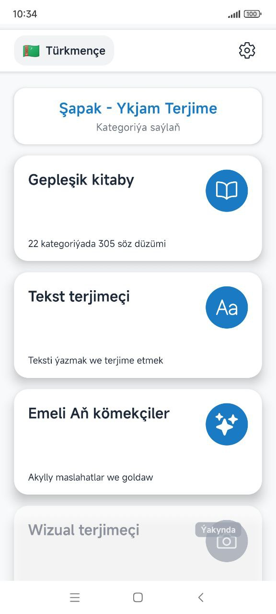
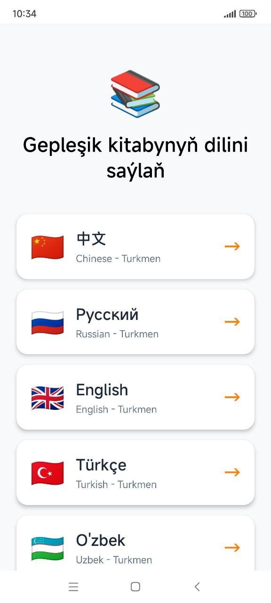
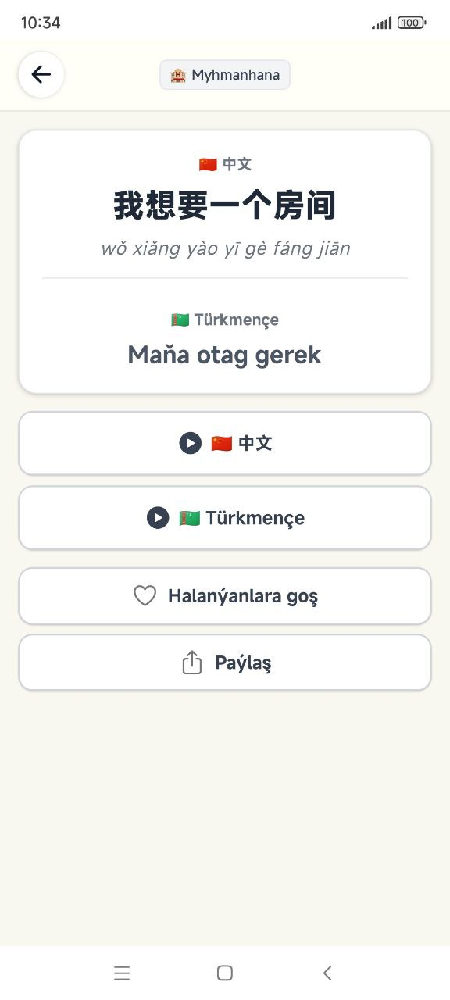

<div align="center">


# Ykjam Terjime

**Туркменский разговорник и языковой помощник для 5+ языков**

[](./LICENSE)
[](https://expo.dev)
[](https://reactnative.dev)
[](https://www.typescriptlang.org)
[](./CONTRIBUTING.md)

[🇬🇧 English](./README.md) · [🇹🇲 Türkmençe](./README.tk.md)

</div>

---

**Ykjam Terjime** (*«Готовый перевод»* на туркменском) — бесплатный оффлайн-разговорник и языковой помощник, созданный специально для носителей туркменского языка. Учись и общайся на китайском, русском, английском и турецком — с аудио произношением, избранным, поиском и многим другим.

Часть **[Shapak-Apps](https://github.com/Shapak-Apps)** — первой open-source организации в Туркменистане.

## 📱 Скриншоты

<div align="center">



</div>

## ✨ Возможности

- 🗣️ **293 фразы** в **22 категориях** (50+ подкатегорий)
- 🌍 **5 языков**: 🇹🇲 туркменский, 🇨🇳 китайский, 🇷🇺 русский, 🇬🇧 английский, 🇹🇷 турецкий
- 🔊 **306 аудио файлов** с произношением носителей (M4A)
- 📴 **Полный оффлайн** — работает без интернета
- 🈲 **Пиньинь-транскрипция** для китайских фраз
- ⭐ **Избранное, статистика, полнотекстовый поиск**
- 🎨 **Чистый минималистичный дизайн** (вдохновлён Lingify)
- 🆓 **100% бесплатно, без рекламы и трекинга**

**В версии 2.0:** ещё 25 языков (немецкий, французский, испанский, японский, корейский, арабский и др.), AI-переводчик, визуальный переводчик.

## 🛠 Технологии

| Слой | Технология |
|------|------------|
| Фреймворк | [Expo SDK 54](https://expo.dev) + [React Native 0.81](https://reactnative.dev) |
| Язык | [TypeScript 5.9](https://www.typescriptlang.org) (strict mode) |
| Навигация | [React Navigation 7](https://reactnavigation.org) (Stack + Bottom Tabs) |
| Хранилище | AsyncStorage (локальное) |
| Аудио | expo-av (локальные MP3 + Expo Speech) |
| API переводов | [MyMemory](https://mymemory.translated.net) + [LibreTranslate](https://libretranslate.com) |
| Сборка | [EAS Build](https://expo.dev/eas) |

## 🚀 Начало работы

### Требования

- [Node.js](https://nodejs.org) 20+
- [Git](https://git-scm.com)
- [Android Studio](https://developer.android.com/studio) (для Android-эмулятора) или [Xcode](https://developer.apple.com/xcode/) (для iOS-симулятора)
- [Expo CLI](https://docs.expo.dev/more/expo-cli/) (устанавливается автоматически через `npx`)

### Установка

```bash
# Клонируем репозиторий
git clone https://github.com/Shapak-Apps/turkmen-phrasebook.git
cd turkmen-phrasebook

# Ставим зависимости
npm install

# Создаём .env (опционально, для AI функций)
cp .env.example .env
# Отредактируй .env и добавь свои API ключи при необходимости
```

### Запуск приложения

```bash
# Запускаем Metro bundler
npm start

# Затем:
#   Нажми `a` — откроется на Android-эмуляторе
#   Нажми `i` — откроется на iOS-симуляторе
#   Нажми `w` — откроется в браузере
```

Или запусти напрямую на устройстве:

```bash
npm run android    # Android
npm run ios        # iOS (только macOS)
```

### Другие команды

```bash
npm test           # Запустить тесты
npm run lint       # Проверить код линтером
npm run lint:fix   # Автоматически исправить ошибки линтера
```

## 📁 Структура проекта

```
turkmen-phrasebook/
├── src/
│   ├── api/             # Клиенты API переводов
│   ├── components/      # Переиспользуемые UI-компоненты
│   ├── contexts/        # React контексты (язык, конфиг)
│   ├── data/            # Фразы, категории, переводы
│   ├── features/        # Модули функций (переводчик, AI, избранное)
│   ├── navigation/      # Конфигурация навигации
│   ├── screens/         # Экраны приложения
│   ├── services/        # Сервисы бизнес-логики
│   └── utils/           # Хелперы и утилиты
├── assets/              # Изображения, иконки, аудио файлы
├── android/             # Нативный Android-проект
├── ios/                 # Нативный iOS-проект
└── App.tsx              # Точка входа
```

## 🤝 Как внести вклад

Принимаются любые контрибьюции — от исправления опечаток до добавления целых языков!

Читай **[гайд контрибьютора](./CONTRIBUTING.md)** — там описано:

- Как настроить проект локально
- Как оформить pull request
- Конвенции кода
- Метки «good first issue» для новичков

**Хорошие задачи для новичков:**
- Добавить переводы на новый язык
- Записать аудио произношение для существующих фраз
- Исправить опечатку, улучшить иконку, отполировать экран
- Написать unit-тесты для существующего кода

Нашёл баг или есть идея? **[Открой issue](https://github.com/Shapak-Apps/turkmen-phrasebook/issues)**.

## 📲 Скачать приложение

<div align="center">

<a href="https://apps.apple.com/app/ykjam-terjime/id6758071845"></a>&nbsp;<a href="https://play.google.com/store/apps/details?id=com.shapak.translator"></a>

</div>

## 📄 Лицензия

Проект распространяется под лицензией **MIT** — см. файл [LICENSE](./LICENSE).

Ты можешь свободно использовать, изменять и распространять этот код, сохраняя оригинальное упоминание авторских прав.

## 👤 Автор

**Сейди Чарыев**
- 📧 Email: [seydi.charyev@gmail.com](mailto:seydi.charyev@gmail.com)
- 🐙 GitHub: [@TheSeydiCharyyev](https://github.com/TheSeydiCharyyev)
- 🏢 Организация: [Shapak-Apps](https://github.com/Shapak-Apps)

## 🙏 Благодарности

- Собрано на [Expo](https://expo.dev) — самый быстрый способ создавать кросс-платформенные мобильные приложения
- Иконки от [Ionicons](https://ionic.io/ionicons)
- API переводов от [MyMemory](https://mymemory.translated.net) и [LibreTranslate](https://libretranslate.com)

---

<div align="center">

Сделано с ❤️ в Туркменистане — для сообщества туркменского языка.

**[⭐ Поставь звезду на GitHub](https://github.com/Shapak-Apps/turkmen-phrasebook)** чтобы поддержать open-source в Туркменистане.

</div>
