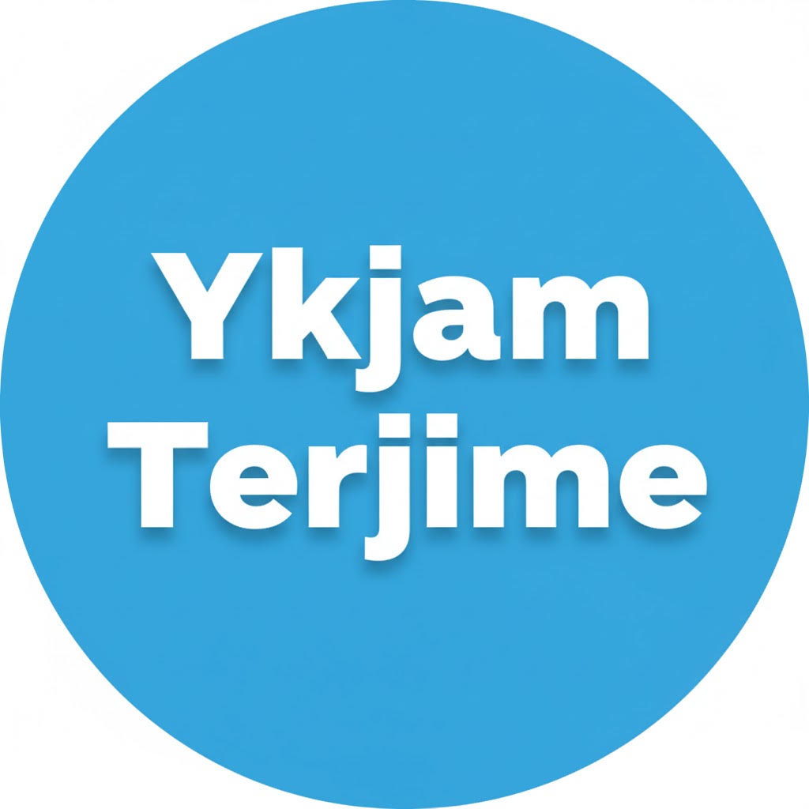
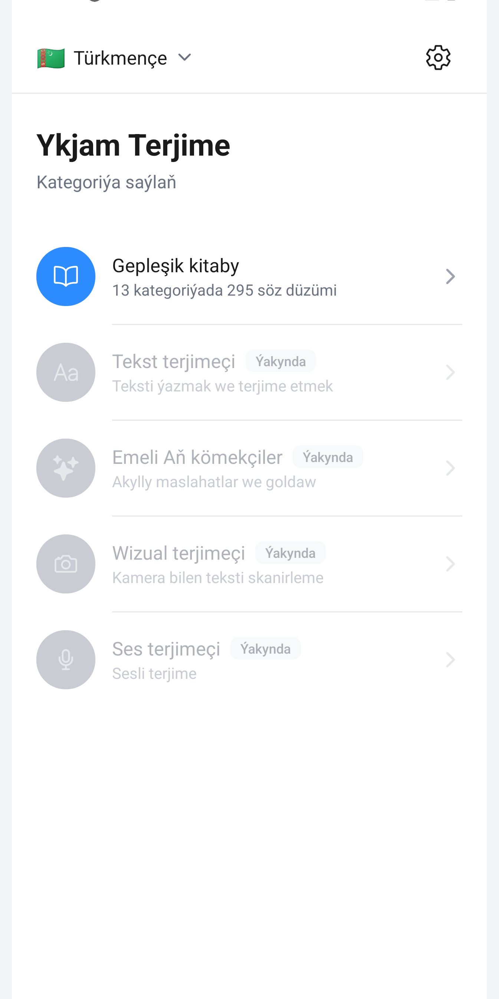
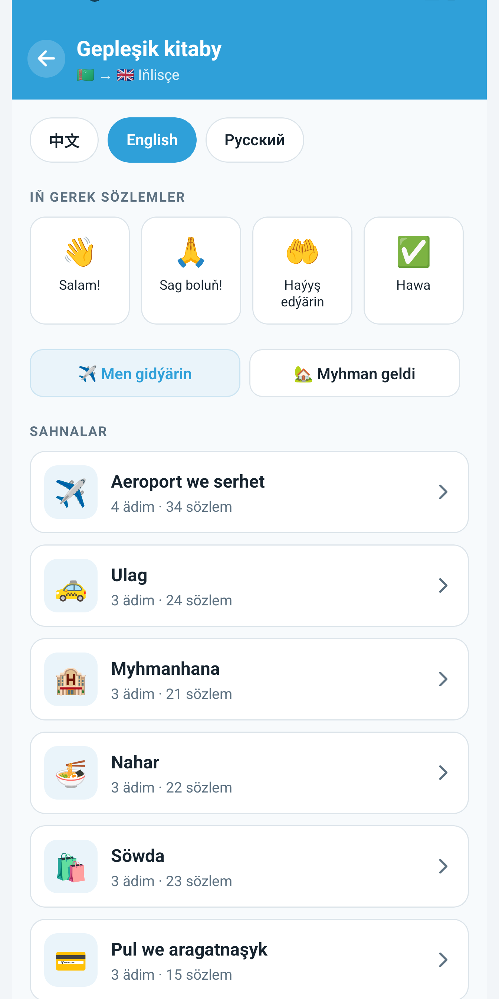
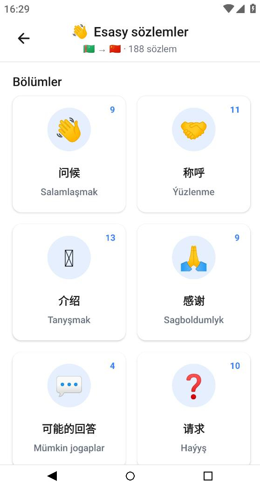
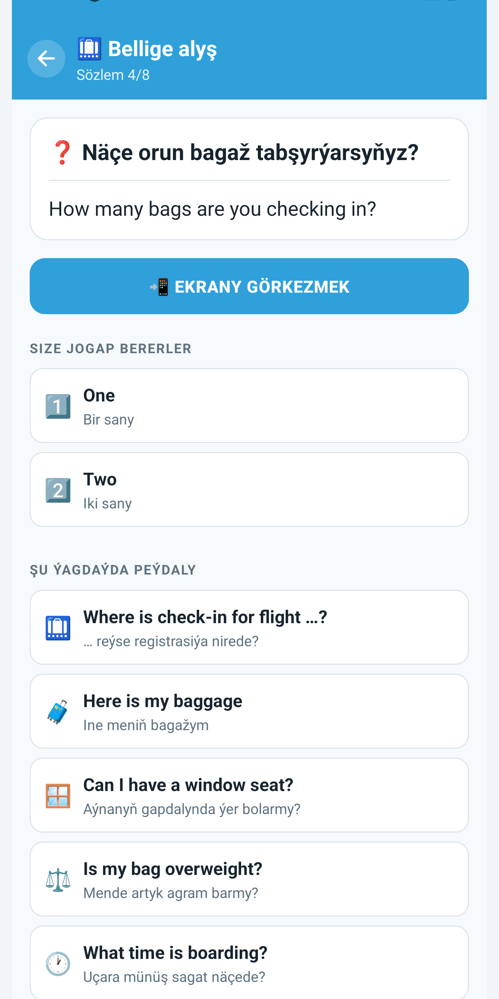
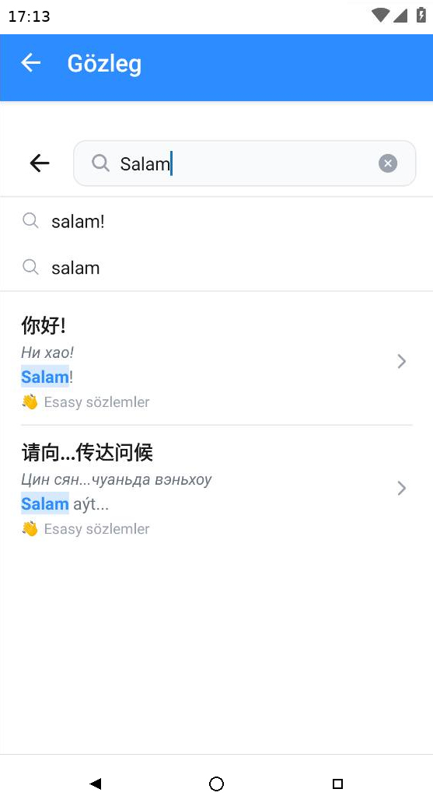
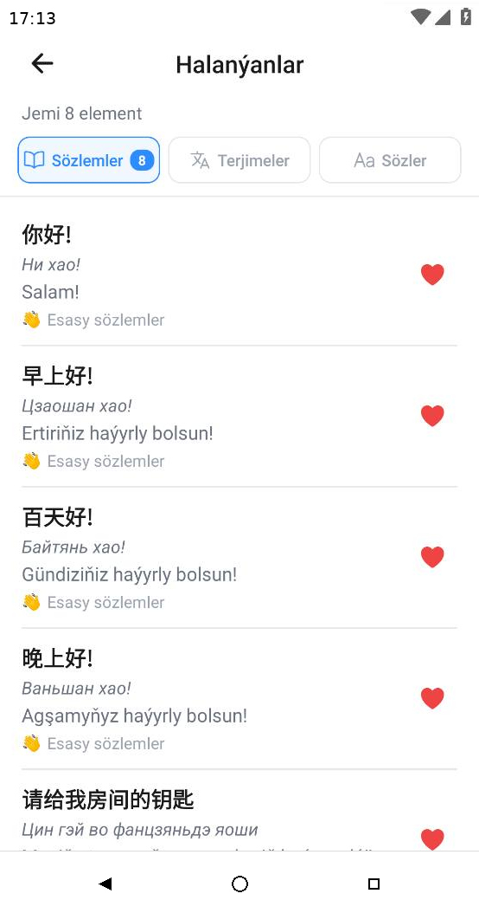

<div align="center">


# Ykjam Terjime

Oflaýn senariý gepleşik kitaby — 13 durmuş senariýasynda 295 saýlama fraza, türkmen dili hytaý, iňlis ýa-da rus dili bilen

[](./LICENSE)
[](https://expo.dev)
[](https://reactnative.dev)
[](https://www.typescriptlang.org)
[](./CONTRIBUTING.md)

[🇬🇧 English](./README.md) · [🇷🇺 По-русски](./README.ru.md)
</div>

Ykjam Terjime — mugt, oflaýn-ileri, senariý esasly gepleşik kitabydyr. Söz sanawlarynyň ýerine, ol sizi 13 durmuş senariýasyndan geçirýär — jemi 295 saýlama fraza — türkmen dilini hytaý, iňlis ýa-da rus dili bilen birleşdirýär. Interfeýs 5 dilde elýeterlidir we programa nol ulgam çagyryşlaryny amala aşyrýar.

[Shapak-Apps](https://github.com/Shapak-Apps) — Türkmenistanyň ilkinji açyk kodly guramasynyň bir bölegi.

## 📱 Ekran şekilleri

<div align="center">
  
  
  
  
  
  
</div>

## ✨ Programma häzir näme edýär

- 🎭 **13 durmuş senariýasy** we **295 saýlama fraza** — 260-y senariýalaryň içinde, goşmaça 35-i programmanyň öz bölümi hökmünde görkezilýär, **"IŇ GEREK SÖZLEMLER"**
- 💬 **Garaşylýan jogaplar** — her fraza beýleki adamyň ähtimal jogabyny görkezip bilýär
- 📺 **Ekrany görkezmek re žimi** — telefon beýleki adamyň okap biljek uly tekstine aýlanýar, basyp bolýan jogaplar bilen
- 🏷️ Dialoglara **SIZDEN SORARLAR** ("senden sorarlar") we **SIZIŇ JOGABYŇYZ** ("siziň jogabyňyz") bellikleri goýulýar
- 🌍 **3 mazmun jübüti**: Türkmen ↔ Hytaý (piniýn bilen), Türkmen ↔ Iňlis, Türkmen ↔ Rus
- 🗺️ **5 interfeýs dili**: türkmen, hytaý, rus, iňlis we türk. Ýene 26-sy eýýäm kodda terjime edildi we eksik interfeýs açarlary tamamlanandan soň açylar
- 📴 **Doly oflaýn** — internet ýok, hasap ýok, nol ulgam çagyryşy
- 🆓 100% mugt, mahabatsyz, yzarlamasyz

Senariýalar iki ganada bölünýär:

| Ganat | Senariýalar |
|-------|-------------|
| ✈️ **Men gidýärin** | Howa menzili · Transport · Myhmanhana · Nahar · Söwda · Pul · Saglyk · Meseleler (8) |
| 🏡 **Myhman geldi** | Ugur · Taksi sürüjisi · Satyjy · Myhmansöýerlik · Syýahatça kömek (5) |

## 📴 Näme üçin oflaýn-ileri?

Türkmenistanda internet haýal ýa-da elýetersiz bolup biler, diňe rusça gürleýän ýaşuly adamlara düşünilmegi zerur, we syýahatça birnäçe sekuntda jogap gerek — ýüklenme aýlawy däl. Oflaýn-ileri bolmak ýetmezçilik däl; bu programmanyň esasy dizaýn kararydyr.

## 🛠 Tehnologiýalar

| Gat | Tehnologiýa |
|-----|-------------|
| Freýmwork | [Expo SDK 54](https://expo.dev) + [React Native 0.81](https://reactnative.dev) |
| Dil | [TypeScript 5.9](https://www.typescriptlang.org) (strict mode) |
| Nawigasiýa | [React Navigation 7](https://reactnavigation.org) (Stack) |
| Ammar | AsyncStorage (lokal-ileri) |
| Gurnama | [EAS Build](https://expo.dev/eas) |

## 🚀 Başlamak

### Zerurlyklar

- [Node.js](https://nodejs.org) 20+
- [Git](https://git-scm.com)
- [Android Studio](https://developer.android.com/studio) (Android emulýatory üçin) ýa-da [Xcode](https://developer.apple.com/xcode/) (iOS simulýatory üçin)

### Gurnama

```bash
# Repozitoriýany klonlaýarys
git clone https://github.com/Shapak-Apps/turkmen-phrasebook.git
cd turkmen-phrasebook

# Baglylyklaryny gurýarys
npm install

# Programmany başladýarys
npx expo start
```

### Beýleki buýruklar

```bash
npm start          # Metro bundler-ni başlatmak
npm run android    # Android emulýatorda/enjamda işletmek
npm run ios        # iOS simulýatorda işletmek (diňe macOS)
npm test           # Testleri işletmek
```

Goşmaça maglumat [Goşant goşmak boýunça gollanmada](./CONTRIBUTING.md).

## 📁 Proýekt gurluşy

```
turkmen-phrasebook/
├── src/
│   ├── config/            # languages.config.ts — interfeýs dilleri (5 elýeterli, 26 gulply)
│   ├── data/
│   │   └── scenarios/     # korpus: skeleton.ts + texts/{tk,ru,en,zh}.ts
│   ├── features/
│   │   └── scenarios/     # senariý ekranlary, ekrany görkezmek re žimi, ui-labels.ts
│   └── navigation/        # AppNavigator.tsx (Stack)
├── assets/                # logo, ekran şekilleri, dükan materiallary
├── android/               # native Android proýekti
├── ios/                   # native iOS proýekti
└── App.tsx                # giriş nokady
```

## 🗺️ Ýol kartasy (meýilnama — heniz programmada ýok)

- 📝 Tekst terjimeçisi
- 🎤 Ses terjimeçisi
- 📷 Wizual terjimeçi (OCR + terjime)
- 🤖 AI kömekçiler

Bu sanawdaky ähli zat geljekki wersiýalar üçin meýilnamadyr. Bularyň hiç biri häzirki çykarylyşda ýok.

## 🤝 Goşant goşmak

Biz islendik goşantlary kabul edýäris — harp ýalňyşyny düzetmekden başlap, frazalary gowulandyrmaga çenli!

**[Goşant goşmak boýunça gollanma](./CONTRIBUTING.md)** okaň — şol ýerde bar:

- Proýekti lokal nädip gurmaly
- Pull request-i nädip tabşyrmaly
- Kod ýazmak düzgünleri
- Täze gelenler üçin «Good first issue» bellikleri

**Täze başlaýanlar üçin gowy wezipeler:**

- Interfeýs terjimesini goşmak ýa-da tamamlamak (26 dil açylmagyna garaşýar)
- Harp ýalňyşyny düzetmek, frazany gowulandyrmak, ekrany timarlamak
- Bar bolan kod üçin unit-test ýazmak

Säwlik tapdyňyzmy ýa-da täze pikiriňiz barmy? **[Issue açyň](https://github.com/Shapak-Apps/turkmen-phrasebook/issues)**.

## 📲 Programmany göçürip almak

<div align="center">

<a href="https://apps.apple.com/app/ykjam-terjime/id6758071845"></a>&nbsp;<a href="https://play.google.com/store/apps/details?id=com.shapak.translator"></a>

</div>

## 📄 Litsenziýa

Bu proýekt **MIT Litsenziýa** esasynda paýlanýar — jikme-jiklikler üçin [LICENSE](./LICENSE) faýlyna serediň.

Asyl awtorlyk belligini saklap, bu programma erkin ulanmaga, üýtgetmäge we paýlaşmaga hukugyňyz bar.

## 👤 Awtor

**Seýdi Çaryýew**
- 📧 E-poçta: [seydi.charyev@gmail.com](mailto:seydi.charyev@gmail.com)
- 🐙 GitHub: [@TheSeydiCharyyev](https://github.com/TheSeydiCharyyev)
- 🏢 Gurama: [Shapak-Apps](https://github.com/Shapak-Apps)

## 🙏 Minnetdarlyk

- [Expo](https://expo.dev) bilen guruldy — kross-platforma mobil programmalary döretmegiň iň çalt ýoly
- Ikonalar: [Ionicons](https://ionic.io/ionicons)

---

<div align="center">

Türkmenistanda ❤️ bilen ýasaldy — türkmen dili jemgyýeti üçin.

**[⭐ GitHub-da ýyldyz goýuň](https://github.com/Shapak-Apps/turkmen-phrasebook)** — Türkmenistanda açyk kody goldaň.

</div>
